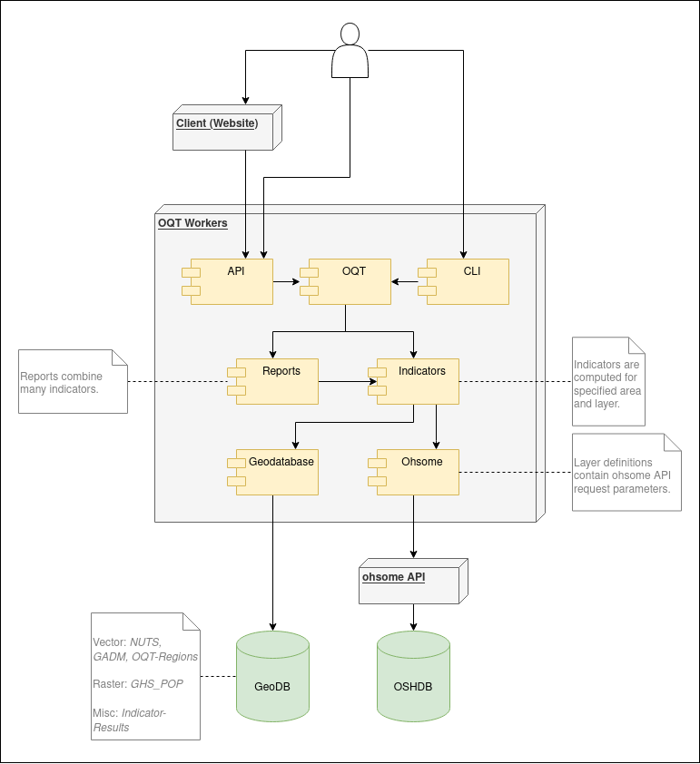

# Proof of Concept for Ohsome Quality analysT

## Vision

What is OQT?
* A project that **formalizes the knowledge on OSM data quality** within HeiGIT and the GIScience Research Group
* A tool that end users, e.g. humanitarian organisations and public administration, can use to get information on the **quality of OSM data for their specific region and use-case**.
* A **web app** that builds upon the existing infrastructure, especially ohsome-hex and the ohsome dashboard
* A **data integration tool**, that brings together the implementation of a variety of intrinsic and extrinsic data quality metrics

For more information check [Confluence](https://confluence.gistools.geog.uni-heidelberg.de/display/OQT/OpenStreetMap+Quality+AnalysT+Home).


## Components

1. Database: PostGIS database
2. Workers/Back-end: Python package ohsome_quality_analyst
3. Website




## Installation

End users should use the [website](https://oqt.ohsome.org/). Following section is for advanced usage of Ohsome Quality analysT. To setup the project for development please refer to [docs/development_setup.md](docs/development_setup.md).

Install the ohsome_quality_analyst Python package.

```bash
cd workers
pip install .
```

In addition to installing the Python package, access to the PostGIS database is required. Please reach out if you need one.


## Usage of the Command Line Interface

```bash
oqt --help
```


## Contributing

Please refer to [CONTRIBUTING.md](CONTRIBUTING.md)


## Development Setup

Please refer to [docs/development_setup.md](docs/development_setup.md).

