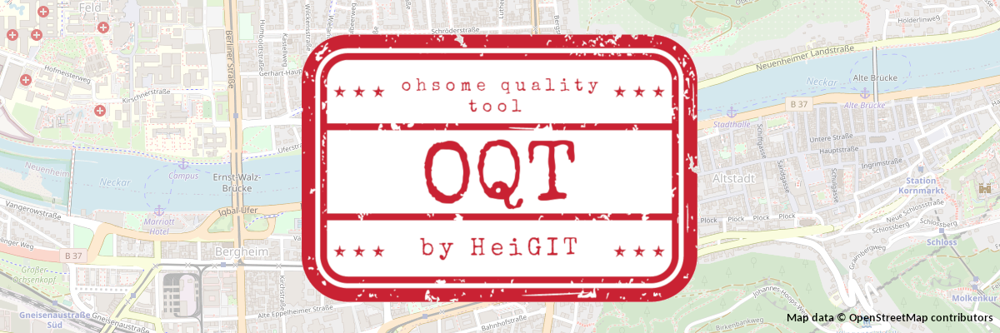

# Proof of Concept for Ohsome Quality Tool

## Vision
What is OQT?
* A project that **formalizes the knowledge on OSM data quality** within HeiGIT and the GIScience Research Group
* A tool that end users, e.g. humanitarian organisations and public administration, can use to get information on the **quality of OSM data for their specific region and use-case**.
* A **web app** that builds upon the existing infrastructure, especially ohsome-hex and the ohsome dashboard
* A **data integration tool**, that brings together the implementation of a variety of intrinsic and extrinsic data quality metrics

For more information check [Confluence](https://confluence.gistools.geog.uni-heidelberg.de/display/oshdb/The+ohsome+Quality+Tool).

## Quickstart
Run the following lines to use the tool from a command line. Make sure that you have `Python3.8` and `poetry` installed on the system level already.
```
git clone https://gitlab.gistools.geog.uni-heidelberg.de/giscience/big-data/ohsome/apps/ohsome-quality-tool.git
cd ohsome-quality-tool
poetry install
poetry shell
oqt --help
```

Run the following line to derive the `BUILDING_COMPLETENESS` indicator:
```
oqt --verbose indicator -i BUILDING_COMPLETENESS -f data/heidelberg_altstadt.geojson 
```

Run the following line to derive the `WATERPROOFING_DATA_FLOODING` report:
```
oqt --verbose report -r WATERPROOFING_DATA_FLOODING -f data/heidelberg_altstadt.geojson
```

## Development
For development setup and contributing setup please have look at [CONTRIBUTING.md](CONTRIBUTING.md)

